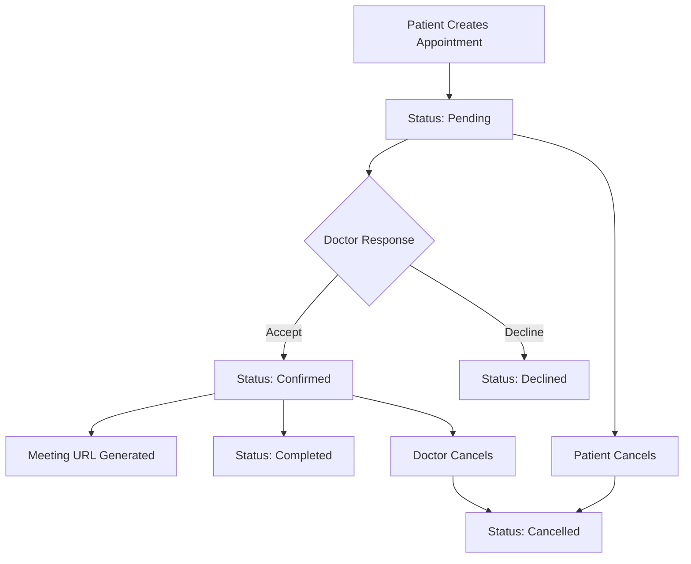

# 📅 Appointment System Integration Guide

## 🎯 Overview

The Rad-Backend now includes a comprehensive appointment management system with full CRUD operations, role-based access control, and video meeting integration. This guide provides everything needed for frontend integration.

## 🔐 Authentication Requirements

**All appointment endpoints require JWT authentication:**
```http
Authorization: Bearer <jwt_token>
```

**Getting Authentication Token:**
```bash
POST /api/auth/login
Content-Type: application/json

{
  "email": "user@example.com",
  "password": "password123",
  "role": "PATIENT" | "DOCTOR" | "ADMIN"
}
```

**Response:**
```json
{
  "success": true,
  "message": "Login successful",
  "token": "eyJhbGciOiJIUzI1NiIsInR5cCI6IkpXVCJ9...",
  "user": {
    "id": "user_id",
    "name": "User Name",
    "email": "user@example.com",
    "role": "PATIENT"
  }
}
```

## 📋 Appointment Data Models

### AppointmentDocument Schema
```typescript
interface AppointmentDocument {
  _id: string;
  patientId: string;              // Reference to Patient
  doctorId: string;               // Reference to Doctor
  appointmentDate: Date;          // Scheduled date/time
  duration: number;               // Duration in minutes (default: 30)
  reason: string;                 // Appointment reason
  notes?: string;                 // Additional notes
  status: AppointmentStatus;      // Current status
  meetingUrl?: string;           // Video meeting URL
  reminderSent: boolean;         // Reminder status
  createdAt: Date;
  updatedAt: Date;
}

type AppointmentStatus = 
  | "Pending"       // Initial status when created
  | "Scheduled"     // Confirmed by system
  | "Confirmed"     // Confirmed by doctor
  | "Completed"     // Appointment finished
  | "Cancelled"     // Cancelled by patient/doctor
  | "Declined";     // Declined by doctor
```

### DoctorAvailabilityDocument Schema
```typescript
interface DoctorAvailabilityDocument {
  _id: string;
  doctorId: string;
  dayOfWeek: number;              // 0-6 (Sunday-Saturday)
  startTime: string;              // "09:00"
  endTime: string;                // "17:00"
  isAvailable: boolean;
  createdAt: Date;
  updatedAt: Date;
}
```

## 🛠 API Endpoints

### Base URL
```
http://localhost:3000/api/appointments
```

### 1. Create Appointment (Patient)
**Endpoint:** `POST /api/appointments/patient`
**Role:** PATIENT
**Description:** Create a new appointment request

**Request Body:**
```json
{
  "doctorId": "6507f1f77bcf86cd79943210",
  "appointmentDate": "2024-01-15T10:00:00.000Z",
  "duration": 30,
  "reason": "Regular checkup",
  "notes": "Experiencing mild symptoms"
}
```

**Response (201):**
```json
{
  "success": true,
  "message": "Appointment request submitted successfully",
  "data": {
    "_id": "6507f1f77bcf86cd79943211",
    "patientId": "6507f1f77bcf86cd79943209",
    "doctorId": "6507f1f77bcf86cd79943210",
    "appointmentDate": "2024-01-15T10:00:00.000Z",
    "duration": 30,
    "reason": "Regular checkup",
    "notes": "Experiencing mild symptoms",
    "status": "Pending",
    "reminderSent": false,
    "createdAt": "2024-01-10T08:30:00.000Z",
    "updatedAt": "2024-01-10T08:30:00.000Z"
  }
}
```

### 2. Get Patient Appointments
**Endpoint:** `GET /api/appointments/patient`
**Role:** PATIENT
**Description:** Get all appointments for the authenticated patient

**Query Parameters:**
- `status` (optional): Filter by status ("Pending", "Scheduled", "Confirmed", "Completed", "Cancelled", "Declined")
- `upcoming` (optional): "true" to get only upcoming appointments

**Response (200):**
```json
{
  "success": true,
  "data": [
    {
      "_id": "6507f1f77bcf86cd79943211",
      "patientId": {
        "_id": "6507f1f77bcf86cd79943209",
        "firstName": "John",
        "lastName": "Doe",
        "email": "john.doe@example.com"
      },
      "doctorId": {
        "_id": "6507f1f77bcf86cd79943210",
        "firstName": "Dr. Jane",
        "lastName": "Smith",
        "email": "dr.smith@hospital.com",
        "specialization": "Cardiology"
      },
      "appointmentDate": "2024-01-15T10:00:00.000Z",
      "duration": 30,
      "reason": "Regular checkup",
      "status": "Confirmed",
      "meetingUrl": "https://meet.jit.si/appointment-6507f1f77bcf86cd79943211"
    }
  ]
}
```

### 3. Get Single Appointment
**Endpoint:** `GET /api/appointments/patient/:id`
**Role:** PATIENT
**Description:** Get details of a specific appointment

**Response (200):**
```json
{
  "success": true,
  "data": {
    "_id": "6507f1f77bcf86cd79943211",
    "patientId": "6507f1f77bcf86cd79943209",
    "doctorId": {
      "_id": "6507f1f77bcf86cd79943210",
      "firstName": "Dr. Jane",
      "lastName": "Smith",
      "specialization": "Cardiology"
    },
    "appointmentDate": "2024-01-15T10:00:00.000Z",
    "duration": 30,
    "reason": "Regular checkup",
    "status": "Confirmed",
    "meetingUrl": "https://meet.jit.si/appointment-6507f1f77bcf86cd79943211"
  }
}
```

### 4. Update Appointment (Patient)
**Endpoint:** `PUT /api/appointments/patient/:id`
**Role:** PATIENT
**Description:** Update appointment details (only for Pending status)

**Request Body:**
```json
{
  "appointmentDate": "2024-01-16T14:00:00.000Z",
  "reason": "Updated reason",
  "notes": "Updated notes"
}
```

### 5. Cancel Appointment (Patient)
**Endpoint:** `DELETE /api/appointments/patient/:id`
**Role:** PATIENT
**Description:** Cancel an appointment

**Response (200):**
```json
{
  "success": true,
  "message": "Appointment cancelled successfully"
}
```

### 6. Get Doctor Appointment Requests
**Endpoint:** `GET /api/appointments/doctor/requests`
**Role:** DOCTOR
**Description:** Get all pending appointment requests for the doctor

**Response (200):**
```json
{
  "success": true,
  "data": [
    {
      "_id": "6507f1f77bcf86cd79943211",
      "patientId": {
        "_id": "6507f1f77bcf86cd79943209",
        "firstName": "John",
        "lastName": "Doe",
        "email": "john.doe@example.com",
        "phone": "+1234567890"
      },
      "appointmentDate": "2024-01-15T10:00:00.000Z",
      "duration": 30,
      "reason": "Regular checkup",
      "notes": "Experiencing mild symptoms",
      "status": "Pending",
      "createdAt": "2024-01-10T08:30:00.000Z"
    }
  ]
}
```

### 7. Accept Appointment Request (Doctor)
**Endpoint:** `POST /api/appointments/doctor/requests/:id/accept`
**Role:** DOCTOR
**Description:** Accept a pending appointment request

**Response (200):**
```json
{
  "success": true,
  "message": "Appointment accepted successfully",
  "data": {
    "_id": "6507f1f77bcf86cd79943211",
    "status": "Confirmed",
    "meetingUrl": "https://meet.jit.si/appointment-6507f1f77bcf86cd79943211",
    "updatedAt": "2024-01-10T09:15:00.000Z"
  }
}
```

### 8. Decline Appointment Request (Doctor)
**Endpoint:** `POST /api/appointments/doctor/requests/:id/decline`
**Role:** DOCTOR
**Description:** Decline a pending appointment request

**Response (200):**
```json
{
  "success": true,
  "message": "Appointment declined successfully",
  "data": {
    "_id": "6507f1f77bcf86cd79943211",
    "status": "Declined",
    "updatedAt": "2024-01-10T09:15:00.000Z"
  }
}
```

### 9. Get Available Doctors
**Endpoint:** `GET /api/appointments/doctors/available`
**Role:** PATIENT, DOCTOR
**Description:** Get list of available doctors with their specializations

**Response (200):**
```json
{
  "success": true,
  "data": [
    {
      "_id": "6507f1f77bcf86cd79943210",
      "firstName": "Dr. Jane",
      "lastName": "Smith",
      "email": "dr.smith@hospital.com",
      "specialization": "Cardiology",
      "isAvailable": true
    },
    {
      "_id": "6507f1f77bcf86cd79943220",
      "firstName": "Dr. Mike",
      "lastName": "Johnson",
      "email": "dr.johnson@hospital.com",
      "specialization": "Neurology",
      "isAvailable": true
    }
  ]
}
```

## 🔄 Appointment Status Workflow



## 🎥 Video Meeting Integration

**Meeting URL Format:**
```
https://meet.jit.si/appointment-{appointmentId}
```

**Features:**
- Automatically generated when appointment is confirmed
- Unique URL for each appointment
- Uses Jitsi Meet for video conferencing
- No additional setup required

## 🔔 Appointment Reminders

**Reminder System:**
- `reminderSent` field tracks reminder status
- Can be integrated with email/SMS services
- Recommended: Send reminder 24 hours before appointment

## ⚠️ Error Handling

**Common Error Responses:**

### 401 Unauthorized
```json
{
  "success": false,
  "message": "Access token required"
}
```

### 403 Forbidden
```json
{
  "success": false,
  "message": "Insufficient permissions"
}
```

### 404 Not Found
```json
{
  "success": false,
  "message": "Appointment not found"
}
```

### 400 Bad Request
```json
{
  "success": false,
  "message": "Validation error",
  "errors": [
    "Doctor ID is required",
    "Appointment date must be in the future"
  ]
}
```

## 🛡️ Security & Validation

**Appointment Creation Validation:**
- Doctor ID must exist and be active
- Appointment date must be in the future
- Appointment date must be during doctor's available hours
- Patient cannot book overlapping appointments
- Doctor cannot have overlapping appointments

**Role-Based Access:**
- **PATIENT**: Can create, view own appointments, update/cancel pending appointments
- **DOCTOR**: Can view requests, accept/decline appointments, view assigned appointments
- **ADMIN**: Full access to all appointments

## 🚀 Frontend Integration Examples

### React/TypeScript Example

```typescript
// types/appointment.ts
export interface Appointment {
  _id: string;
  patientId: string | PatientInfo;
  doctorId: string | DoctorInfo;
  appointmentDate: string;
  duration: number;
  reason: string;
  notes?: string;
  status: AppointmentStatus;
  meetingUrl?: string;
  reminderSent: boolean;
  createdAt: string;
  updatedAt: string;
}

// services/appointmentService.ts
import axios from 'axios';

const API_BASE = 'http://localhost:3000/api';

export const appointmentService = {
  // Create appointment
  createAppointment: async (data: CreateAppointmentRequest) => {
    const response = await axios.post(
      `${API_BASE}/appointments/patient`,
      data,
      {
        headers: {
          'Authorization': `Bearer ${localStorage.getItem('token')}`,
          'Content-Type': 'application/json'
        }
      }
    );
    return response.data;
  },

  // Get patient appointments
  getPatientAppointments: async (filters?: { status?: string; upcoming?: boolean }) => {
    const params = new URLSearchParams();
    if (filters?.status) params.append('status', filters.status);
    if (filters?.upcoming) params.append('upcoming', 'true');
    
    const response = await axios.get(
      `${API_BASE}/appointments/patient?${params.toString()}`,
      {
        headers: {
          'Authorization': `Bearer ${localStorage.getItem('token')}`
        }
      }
    );
    return response.data;
  },

  // Get available doctors
  getAvailableDoctors: async () => {
    const response = await axios.get(
      `${API_BASE}/appointments/doctors/available`,
      {
        headers: {
          'Authorization': `Bearer ${localStorage.getItem('token')}`
        }
      }
    );
    return response.data;
  },

  // Cancel appointment
  cancelAppointment: async (appointmentId: string) => {
    const response = await axios.delete(
      `${API_BASE}/appointments/patient/${appointmentId}`,
      {
        headers: {
          'Authorization': `Bearer ${localStorage.getItem('token')}`
        }
      }
    );
    return response.data;
  }
};
```

### Vue.js Example

```javascript
// composables/useAppointments.js
import { ref, computed } from 'vue'
import axios from 'axios'

export function useAppointments() {
  const appointments = ref([])
  const loading = ref(false)
  const error = ref(null)

  const upcomingAppointments = computed(() => {
    const now = new Date()
    return appointments.value.filter(apt => 
      new Date(apt.appointmentDate) > now && 
      ['Confirmed', 'Scheduled'].includes(apt.status)
    )
  })

  const createAppointment = async (appointmentData) => {
    loading.value = true
    error.value = null
    
    try {
      const response = await axios.post('/api/appointments/patient', appointmentData, {
        headers: {
          'Authorization': `Bearer ${localStorage.getItem('token')}`
        }
      })
      
      appointments.value.push(response.data.data)
      return response.data
    } catch (err) {
      error.value = err.response?.data?.message || 'Failed to create appointment'
      throw err
    } finally {
      loading.value = false
    }
  }

  const fetchAppointments = async () => {
    loading.value = true
    
    try {
      const response = await axios.get('/api/appointments/patient', {
        headers: {
          'Authorization': `Bearer ${localStorage.getItem('token')}`
        }
      })
      
      appointments.value = response.data.data
    } catch (err) {
      error.value = err.response?.data?.message || 'Failed to fetch appointments'
    } finally {
      loading.value = false
    }
  }

  return {
    appointments,
    upcomingAppointments,
    loading,
    error,
    createAppointment,
    fetchAppointments
  }
}
```

## 📱 Mobile Integration (React Native)

```javascript
// services/AppointmentAPI.js
import AsyncStorage from '@react-native-async-storage/async-storage';

class AppointmentAPI {
  constructor() {
    this.baseURL = 'http://localhost:3000/api';
  }

  async getAuthHeaders() {
    const token = await AsyncStorage.getItem('authToken');
    return {
      'Content-Type': 'application/json',
      'Authorization': `Bearer ${token}`
    };
  }

  async createAppointment(appointmentData) {
    const headers = await this.getAuthHeaders();
    
    const response = await fetch(`${this.baseURL}/appointments/patient`, {
      method: 'POST',
      headers,
      body: JSON.stringify(appointmentData)
    });

    if (!response.ok) {
      throw new Error('Failed to create appointment');
    }

    return response.json();
  }

  async getAppointments(filters = {}) {
    const headers = await this.getAuthHeaders();
    const queryParams = new URLSearchParams(filters).toString();
    
    const response = await fetch(
      `${this.baseURL}/appointments/patient?${queryParams}`,
      { headers }
    );

    if (!response.ok) {
      throw new Error('Failed to fetch appointments');
    }

    return response.json();
  }
}

export default new AppointmentAPI();
```

## 🎛️ Admin Dashboard Integration

```typescript
// For admin dashboard to manage all appointments
export const adminAppointmentService = {
  // Get all appointments (admin only)
  getAllAppointments: async (filters?: {
    status?: string;
    doctorId?: string;
    patientId?: string;
    dateRange?: { start: string; end: string };
  }) => {
    // Implementation for admin endpoints
  },

  // Get appointment statistics
  getAppointmentStats: async () => {
    // Implementation for appointment analytics
  }
};
```

## 🗄️ Database Status

⚠️ **Current Issue**: MongoDB Atlas connection credentials mismatch
- **Problem**: Environment variables have `nsiahkofidennis001` credentials but Atlas expects `obed` credentials
- **Impact**: Authentication endpoints timeout due to database connection failure
- **Solution**: Update MongoDB Atlas credentials or .env file to match

**To fix database connectivity:**
1. Either update .env file with correct Atlas credentials
2. Or update Atlas cluster with current .env credentials
3. Restart the server after credential update

## 📚 Additional Resources

- **Swagger Documentation**: `http://localhost:3000/api-docs`
- **Postman Collection**: Import from Swagger JSON
- **Database Models**: Located in `src/models/appointment.ts`
- **Service Layer**: Located in `src/services/appointment.service.ts`
- **API Routes**: Located in `src/routes/appointment.routes.ts`

## 🎉 Integration Checklist

### Frontend Development
- [ ] Set up HTTP client with JWT token handling
- [ ] Create appointment booking form
- [ ] Implement appointment list view
- [ ] Add appointment status management
- [ ] Integrate video meeting links
- [ ] Add appointment reminders
- [ ] Implement error handling
- [ ] Add loading states

### Testing
- [ ] Fix database connectivity
- [ ] Test all API endpoints
- [ ] Verify role-based access
- [ ] Test appointment workflow
- [ ] Validate error handling
- [ ] Test video meeting integration

### Production Deployment
- [ ] Update environment variables
- [ ] Configure MongoDB Atlas
- [ ] Set up proper JWT secrets
- [ ] Configure CORS for frontend domain
- [ ] Set up SSL certificates
- [ ] Configure email/SMS for reminders

---

**Status**: ✅ **API Implementation Complete** | ⚠️ **Database Connection Issue** | 🚀 **Ready for Frontend Integration**
